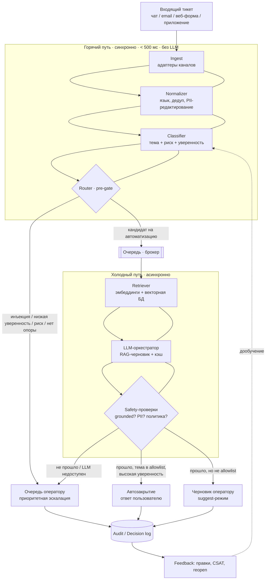
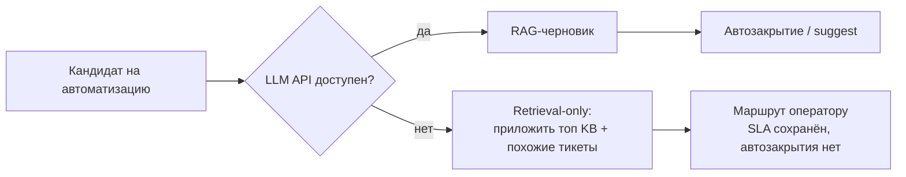

# architecture.md — целевая архитектура

## Принцип: два пути

Требования ТЗ — одновременно держать **скорость, безопасность и стоимость**.
Отсюда главное архитектурное решение: разделить обработку на два пути.

- **Горячий путь (синхронный, цель < 500 мс, без LLM):** приём → нормализация и
  PII-редактирование → классификация (тема + риск + уверенность) → маршрутизация.
  Здесь только быстрые дешёвые модели (правила + классический классификатор).
  LLM на горячем пути запрещён — он медленный и дорогой на объёме 200k/день.
- **Холодный путь (асинхронный):** для кандидатов на автоматизацию — retrieval
  по базе знаний и похожим тикетам → генерация черновика LLM (RAG) → проверки
  безопасности → доставка (автозакрытие или черновик оператору) → аудит-лог.

Разделение даёт корректную деградацию: горячий путь не зависит от LLM, поэтому
при отказе LLM API маршрутизация и SLA сохраняются, а холодный путь откатывается
на retrieval-only + маршрут оператору.

## Основные компоненты

| Компонент | Назначение | Путь |
|---|---|---|
| Ingest / адаптеры каналов | приём из чата, email, веб-формы, приложения; унификация формата | горячий |
| Normalizer | язык, дедуп-ключ, **PII-редактирование** до внешних вызовов | горячий |
| Classifier | тема + уровень риска + калиброванная уверенность | горячий |
| Router | детерминированное решение по правилам + порогам | горячий |
| Queue (брокер) | буфер между горячим и холодным путём, сглаживает пики | граница |
| Retriever | поиск по эмбеддингам в векторной БД (KB + решённые тикеты) | холодный |
| LLM-оркестратор | RAG-генерация черновика/суммаризации, кэш, лимиты стоимости | холодный |
| Safety / Guardrails | groundedness, утечка PII, prompt injection, политика | холодный |
| Human-in-the-loop | очереди оператору (suggest + эскалация); UI вне скоупа | оба |
| Audit / Decision log | append-only запись каждого автоматического решения | оба |
| Feedback capture | правки операторов, CSAT, reopen → данные для дообучения | асинхронно |

## Поток данных: от тикета до ответа/маршрута

## Синхронные и асинхронные части

- **Синхронно (горячий путь):** Ingest → Normalizer → Classifier → Router.
  Бюджет < 500 мс на тикет. Возвращает пользователю подтверждение приёма и
  внутренне — маршрут. Не блокируется генерацией.
- **Асинхронно (холодный путь):** Retriever → LLM → Safety → доставка. Работает
  из очереди, может занимать секунды. Пики (10–20k/10 мин) поглощаются очередью
  и деградацией качества сервиса (генерация ждёт, маршрутизация — нет).

## Хранилища

- **Ticket store** (OLTP, напр. PostgreSQL) — тикеты, статусы, решения.
- **Vector store** (Qdrant / pgvector) — эмбеддинги KB и решённых тикетов.
- **KB store** — статьи базы знаний (версионируется; версия KB — часть ключа кэша).
- **Audit log** (append-only, напр. отдельная таблица / ClickHouse) — все
  автоматические решения для аудита.
- **Cache** (Redis) — кэш ответов LLM по ключу (хеш нормализованного тикета +
  версия KB) и дедупликация обращений в инцидентах.

## Места вызова сервисов и интеграций

- Внешний LLM API — только на холодном пути, за оркестратором с таймаутами,
  ретраями с backoff, кэшем и circuit breaker по стоимости/доступности.
- Векторная БД и KB — на холодном пути (retrieval).
- Интеграции продукта (биллинг, статус заказа) — по требованию оператора или в
  шаблонах ответов; на горячем пути не вызываются, чтобы держать < 500 мс.

## Участие человека и запасные пути

- **Human-in-the-loop обязателен** для: рискованных категорий (возврат, платежи,
  удаление аккаунта, запрос данных, безопасность, жалобы/юридические), любой
  низкой уверенности, сработавшей защиты (injection / небезопасный выход).
- **Запасные пути (деградация):**
  - LLM недоступен → холодный путь отдаёт retrieval-only (топ статей KB + похожие
    тикеты) и маршрутизирует оператору; автозакрытие отключается.
  - Векторная БД недоступна → генерация без grounding запрещена → оператору.
  - Перегрузка → очередь + приоритезация рискованных; при переполнении — режим
    «только маршрутизация», генерация ставится на паузу.

## Как это отражено в PoC

Порядок этапов в `poc/pipeline.py` повторяет горячий→холодный поток выше.
Router (`poc/router.py`) реализует детерминированный pre-gate; деградация при
`SIMULATE_LLM_DOWN=1` соответствует правой ветке второй диаграммы; аудит-лог —
`decisions.log.jsonl`. Векторная БД, брокер и эмбеддинг-модель в PoC заменены
in-memory TF-IDF и мок-LLM (см. `docs/ml.md`).
